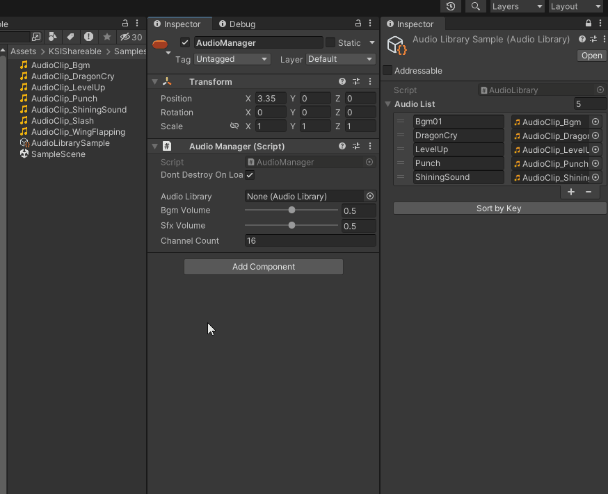

# ShowScriptableObject

## 목차
- [개요](#개요)
- [특징](#특징)
- [사용 방법](#사용-방법)
- [API](#api)
- [샘플 코드](#샘플-코드)

---

## 개요
`ShowScriptableObject`는 Unity 인스펙터에서 `ScriptableObject`를 보다 편리하게 관리할 수 있도록 도와주는 **커스텀 프로퍼티 드로어**입니다.  
이 속성을 사용하면 `ScriptableObject` 필드를 인스펙터에서 확장하여 내부 값을 직접 편집할 수 있습니다.

## 특징
- **인스펙터에서 `ScriptableObject`를 직접 편집 가능**
- **객체가 없는 경우 기본 필드만 표시**
- **객체가 있는 경우 내부 속성을 계층적으로 표시**
 

## 사용 방법  
1. `[ShowScriptableObject]`를 사용하여 `ScriptableObject` 필드를 인스펙터에서 확장할 수 있도록 설정합니다.

```csharp
public class ExampleComponent : MonoBehaviour
{
    [ShowScriptableObject]
    public MyScriptableObject myScriptableObject;
}
```

2. `ScriptableObject`가 할당된 경우, 인스펙터에서 해당 객체의 내부 값을 편집할 수 있습니다.

## 샘플 코드
```csharp
using UnityEngine;

[CreateAssetMenu(fileName = "MyScriptableObject", menuName = "Example/MyScriptableObject")]
public class MyScriptableObject : ScriptableObject
{
    public string data;
    public int value;
}

public class ExampleComponent : MonoBehaviour
{
    [ShowScriptableObject]
    public MyScriptableObject myScriptableObject;
}
```

