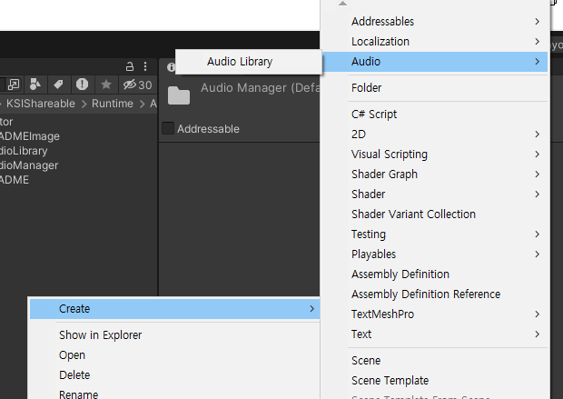
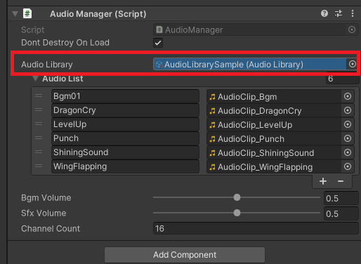
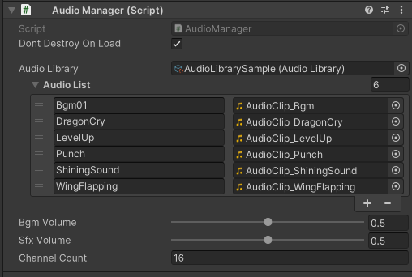
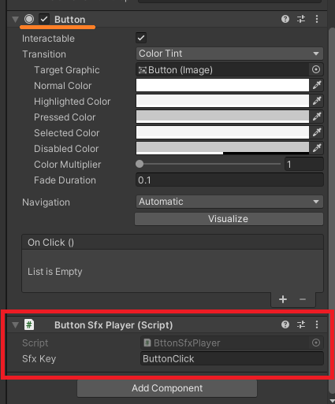

# AudioManager

## 목차
- [개요](#개요)
- [특징](#특징)
- [설정](#설정)
- [사용 방법](#사용-방법)
  - [배경음(BGM) 재생](#배경음bgm-재생)
  - [효과음(SFX) 재생](#효과음sfx-재생)
  - [볼륨 조절](#볼륨-조절)
- [API](#api)
  - [AudioManager](#audiomanager)
  - [AudioLibrary](#audiolibrary)
- [샘플 코드](#샘플-코드)

---

## 개요
`AudioManager`는 싱글톤 패턴을 사용하여 **게임 내 BGM과 효과음을 관리**하는 시스템입니다.
사운드는 `AudioLibrary`를 통해 관리되며, 키 값을 사용하여 접근할 수 있습니다.

## 특징
- **싱글톤 패턴 적용** (`AudioManager.Instance`)
- **BGM 및 SFX 재생, 정지, 일시 정지 지원**
- **효과음 다중 채널 시스템 적용** (동시에 여러 효과음 재생 가능)
- **볼륨 조절 기능 지원** (`BgmVolume`, `SfxVolume`)
- **Fade In/Out 지원**
- **`AudioLibrary`를 활용한 사운드 관리**

## 설정
1. `AudioLibrary` ScriptableObject를 생성하고, 오디오 클립을 추가합니다.
  

2. `AudioManager` 프리팹을 씬에 추가하고 `audioLibrary`에 `AudioLibrary`를 할당합니다.  
 

3. 볼륨 조절 및 채널 개수를 설정합니다.

## 사용 방법

### 컴포넌트

#### Dont Destroy On Load - 체크 시 DontDestroyOnLoad()함수를 실행하여 Scene이 변경되어도 GameObject가 삭제되지 않는다
#### AudioLibrary - AudioLibrary 에셋을 연결하여 키값을 이용해 AudioClip에 접근할 수 있다 ([ShowScriptableObject적용](../../../Editor/ShowScriptableObject/README.md))
#### BgmVolume - Bgm의 볼륨을 조절할 수 있다 (0 ~ 1)
#### SfxVolume - Sfx의 볼륨을 조절할 수 있다 (0 ~ 1)
#### ChannelCount - 동시에 재생할 수 있는 Sfx의 최대 개수 (런타임 변경 불가)

### 스크립트
#### 배경음(BGM) 재생
```csharp
AudioManager.Instance.PlayBgm("MainTheme");
AudioManager.Instance.StopBgm();
AudioManager.Instance.PauseBgm();
AudioManager.Instance.UnPauseBgm();
```

#### 효과음(SFX) 재생
```csharp
AudioManager.Instance.PlaySfx("ButtonClick");
```

#### 볼륨 조절
```csharp
AudioManager.Instance.BgmVolume = 0.8f;
AudioManager.Instance.SfxVolume = 0.6f;
```

### 부가 컴포넌트
#### ButtonSfxPlayer (🔊 버튼 클릭 시 SFX 자동 재생)
  
`Button` 컴포넌트가 있는 게임오브젝트에 `ButtonSfxPlayer` 컴포넌트 추가  
Sfx Key - `AudioLibrary`에 추가한 AudioClip의 Key를 입력
<details>
  <summary>코드 보기</summary>

```csharp
public class ButtonSfxPlayer : MonoBehaviour
{
    [SerializeField] private string sfxKey = "ButtonClick";

    private void Awake() {
        Button button = GetComponent<Button>();
        if (button != null) {
            button.onClick.AddListener(() => PlaySfx());
        }
    }

    private void PlaySfx() {
        AudioManager.Instance.PlaySfx(sfxKey);
    }
}
```
</details>

## API

### `AudioManager`
```csharp
public void FadeBgm(string key, float duration)
public void FadeBgm(AudioClip clip, float duration)

public void PlayBgm(string key);
public void PlayBgm(AudioClip clip);

public void StopBgm();
public void PauseBgm();
public void UnPauseBgm();

public void PlaySfx(AudioClip clip);
public void PlaySfx(string key);
```
- `FadeBgm(key, duration)`: 키 값에 해당하는 배경음을 Fade In, 이전 배경음을 Fade Out 하여 재생합니다.
- `FadeBgm(clip, duration)`: clip 배경음을 Fade In, 이전 배경음을 Fade Out 하여 재생합니다.
- `PlayBgm(clip)`: clip 배경음을 재생합니다.
- `PlayBgm(key)`: 키 값에 해당하는 배경음을 재생합니다.
- `StopBgm()`: 현재 재생 중인 배경음을 정지합니다.
- `PauseBgm()`: 현재 배경음을 일시 정지합니다.
- `UnPauseBgm()`: 일시 정지된 배경음을 다시 재생합니다.
- `PlaySfx(clip)`: clip 효과음을 재생합니다.
- `PlaySfx(key)`: 키 값에 해당하는 효과음을 재생합니다.

### `AudioLibrary`
```csharp
public AudioClip GetClip(string key);
public List<string> GetAllKeys();
```
- `GetClip(key)`: 키 값에 해당하는 `AudioClip`을 반환합니다.
- `GetAllKeys()`: 등록된 모든 키 목록을 반환합니다.

## 샘플 코드
```csharp
using UnityEngine;
using KSIShareable.Audio;

public class AudioTest : MonoBehaviour
{
    void Start()
    {
        AudioManager.Instance.PlayBgm("MainTheme");
        AudioManager.Instance.PlaySfx("ButtonClick");
    }

    void Update()
    {
        if (Input.GetKeyDown(KeyCode.M))
        {
            AudioManager.Instance.StopBgm();
        }
    }
}
```

