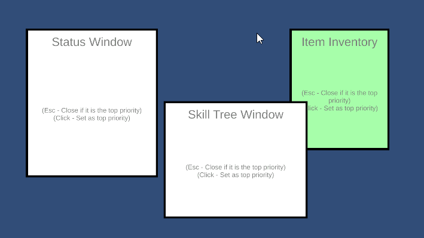
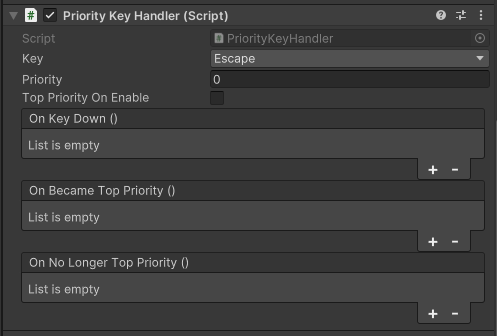

[<- 상위 페이지로 가기](../../../README.md)  

# PriorityKeyHandler

## 목차
- [개요](#개요)
- [특징](#특징)
- [사용 방법](#사용-방법)
  - [우선순위 시스템](#우선순위-시스템)
  - [이벤트 등록](#이벤트-등록)
- [API](#api)
  - [우선순위 관련 메서드](#우선순위-관련-메서드)
  - [이벤트](#이벤트)
- [샘플 코드](#샘플-코드)

---

## 개요
`PriorityKeyHandler`는 특정 키 입력을 관리하고 우선순위를 기반으로 처리할 수 있도록 하는 유틸리티 클래스입니다.
여러 개의 `PriorityKeyHandler`가 동일한 키를 감지할 때, 가장 높은 우선순위를 가진 핸들러만 입력을 처리합니다.

## 특징
- 키 입력에 대한 우선순위 시스템 제공
- `OnKeyDown` 이벤트를 한 프레임에 한 번만 호출
- 최상위 우선순위 변경 시 이벤트 트리거
- `OnEnable` 및 `OnDisable` 시 우선순위 자동 정렬

## 사용 방법

### 우선순위 시스템
각 `PriorityKeyHandler`는 `priority` 값을 가지며, 높은 값을 가진 핸들러가 최상위 우선순위가 됩니다.
최상위 우선순위가 변경되면 `OnBecameTopPriority` 및 `OnNoLongerTopPriority` 이벤트가 호출됩니다.

```csharp
handlerA.Priority = 10; // 우선순위를 10으로 설정
handlerB.Priority = 5;  // handlerA가 우선순위가 더 높으므로 handlerB는 입력을 처리하지 않음
```

### 예시
  

### 컴포넌트
  
#### Key - 입력을 감지할 키 (★같은 키 끼리만 우선순위를 비교하며, 키가 다를 경우 서로 간섭하지 않는다.)
#### Priority - 우선순위 (숫자가 높은 수록 우선순위도 높다)
#### Top Priority On Enable - 체크하면 해당 컴포넌트가 활성화될때 현재 최상위 우선순위보다 1높은 우선순위 값을 가지게 된다.
#### OnKeyDown - 최상위 우선순위로써 키가 눌렀을 경우 호출하는 이벤트
#### OnBecameTopPriority - 최상위 우선순위가 되면 호출하는 이벤트
#### OnNoLongerTopPriority - 최상위 우선순위가 아니면 호출하는 이벤트 (활성화될때 최상위 우선순위가 아닐경우도 호출)


## API

### 우선순위 관련 메서드
```csharp
public bool IsTopPriority();
```
- 현재 핸들러가 최상위 우선순위인지 확인합니다.

```csharp
public int GetTopPriority();
```
- 현재 키의 최상위 우선순위를 반환합니다.

```csharp
public void SetAsTopPriority();
```
- 현재 키의 최상위 우선순위보다 1 높은 값을 부여하여 최상위 우선순위로 설정합니다.

### 이벤트
```csharp
public UnityEvent OnKeyDown;
public UnityEvent OnBecameTopPriority;
public UnityEvent OnNoLongerTopPriority;
```
- `OnKeyDown`: 키가 눌릴 때 실행되는 이벤트
- `OnBecameTopPriority`: 최상위 우선순위가 되었을 때 실행되는 이벤트
- `OnNoLongerTopPriority`: 최상위 우선순위를 잃었을 때 실행되는 이벤트
