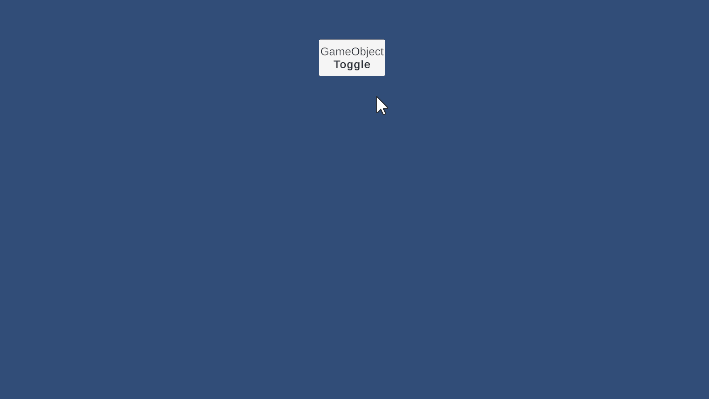
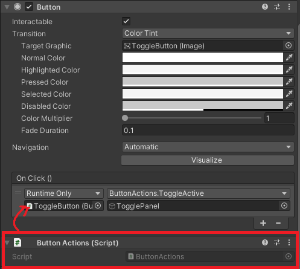
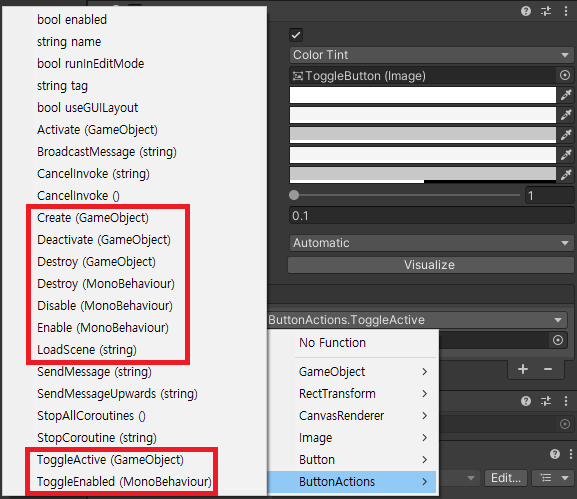

# ButtonActions

## 목차
- [개요](#개요)
- [특징](#특징)
- [사용 방법](#사용-방법)
  - [씬 로드](#씬-로드)
  - [게임 오브젝트 활성화/비활성화](#게임-오브젝트-활성화비활성화)
  - [게임 오브젝트 생성/삭제](#게임-오브젝트-생성삭제)
  - [컴포넌트 활성화/비활성화](#컴포넌트-활성화비활성화)
- [API](#api)
  - [LoadScene](#loadscene)
  - [게임 오브젝트 관련 메서드](#게임-오브젝트-관련-메서드)
  - [컴포넌트 관련 메서드](#컴포넌트-관련-메서드)
- [샘플 코드](#샘플-코드)

---

## 개요
`ButtonActions`는 Unity UI 버튼에서 직접 호출할 수 있는 다양한 기능을 제공하여 추가적인 스크립트 작성을 줄이는 유틸리티 클래스입니다. 
주요 기능으로는 씬 이동, 게임 오브젝트의 활성화/비활성화, 생성/삭제, 컴포넌트의 활성화/비활성화 등이 포함됩니다.

## 특징
- 버튼 이벤트에서 직접 사용 가능
- 씬 로드 기능 제공
- 게임 오브젝트의 활성화/비활성화 및 토글 기능
- 게임 오브젝트의 생성 및 삭제 기능
- 컴포넌트의 활성화/비활성화 및 토글 기능

## 사용 방법

### 예시
  

### 컴포넌트
  

  

## API

### `LoadScene`
```csharp
public void LoadScene(string sceneName);
```
- 지정한 `sceneName`의 씬을 로드합니다.

### 게임 오브젝트 관련 메서드
```csharp
public void Activate(GameObject gameObject);
public void Deactivate(GameObject gameObject);
public void ToggleActive(GameObject gameObject);
public void Create(GameObject prefab);
public void Destroy(GameObject gameObject);
```
- `Activate`: 게임 오브젝트를 활성화합니다.
- `Deactivate`: 게임 오브젝트를 비활성화합니다.
- `ToggleActive`: 게임 오브젝트의 활성 상태를 토글합니다.
- `Create`: 프리팹을 인스턴스화하여 생성합니다.
- `Destroy`: 게임 오브젝트를 삭제합니다.

### 컴포넌트 관련 메서드
```csharp
public void Enable(MonoBehaviour monoBehaviour);
public void Disable(MonoBehaviour monoBehaviour);
public void ToggleEnabled(MonoBehaviour monoBehaviour);
public void Destroy(MonoBehaviour monoBehaviour);
```
- `Enable`: `MonoBehaviour` 컴포넌트를 활성화합니다.
- `Disable`: `MonoBehaviour` 컴포넌트를 비활성화합니다.
- `ToggleEnabled`: `MonoBehaviour` 컴포넌트의 활성 상태를 토글합니다.
- `Destroy`: `MonoBehaviour` 컴포넌트를 삭제합니다.
