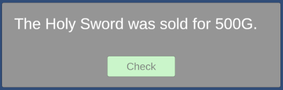
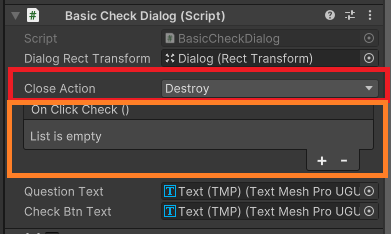

[<- 상위 페이지로 가기](../../../../README.md)  
[<- ConfirmationDialog](../ConfirmationDialog/README.md)  

# CheckDialog

## 목차
- [개요](#개요)
- [특징](#특징)
- [사용 방법](#사용-방법)
- [API](#api)
  - [BasicCheckDialog](#basiccheckdialog)
  - [LocalizeCheckDialog](#localizecheckdialog)
  - [공통 API](#공통-api)
- [샘플 코드](#샘플-코드)

---

## 개요
`CheckDialog`는 사용자가 정보를 보고 직접 확인 액션을 수행하도록 유도하는 대화 상자입니다. 

## 특징
- 메시지와 버튼의 `Text`를 쉽게 설정 가능
- 확인 버튼 클릭 시 발생할 이벤트 설정 가능
- 대화 상자 종료 시 `Destroy` / `Disable` / `Nothing` 설정 가능
- `Localize` 버전 지원

## 사용 방법
### 예시
  

### 컴포넌트  
  
#### Close Action - 대화 상자의 종료 시 액션(`Destroy` / `Disable` / `Nothing`) 설정 가능  
#### OnClickCheck - 확인 버튼 클릭 시 호출하는 이벤트  

### 스크립트
아래 예제는 `BasicCheckDialog`를 생성하고 초기화하는 방법을 보여줍니다.

```csharp
public void CreateDialog() {
    string questionText = "The Holy Sword was sold for 500G.";
    string checkBtnText = "Check";

    var dialog = Instantiate(dialogPrefab);
    dialog.Init(questionText, checkBtnText, null);
}
```


## API

### `BasicCheckDialog`
```csharp
public CheckDialog Init(
    string questionText, 
    string checkBtnText, 
    UnityAction actionOnCheck, 
)
```
- 기본 `CheckDialog` 초기화
- `questionText`: 질문 텍스트
- `checkBtnText`: 확인 버튼 텍스트
- `actionOnCheck`: 확인 버튼 클릭 시 실행할 콜백

### `LocalizeCheckDialog`
```csharp
public CheckDialog Init(
    LocalizedString questionText, 
    LocalizedString checkBtnText, 
    UnityAction actionOnCheck, 
)
```
- `LocalizedString`을 활용한 `CheckDialog` 초기화
- 다국어 지원을 위해 `LocalizedString` 사용

### `공통 API`
```csharp
void ActOnClickCheck()
```
- 확인 버튼 클릭 시 실행되는 함수


```csharp
void SetWidth(float width)
```
- 대화 상자의 너비 설정

```csharp
void SetSortOrder(int order)
```
- 대화 상자의 Canvas의 `Sorting Order` 설정

## 샘플 코드
```csharp
using KSIShareable.UI.Dialog;
using UnityEngine;

namespace KSIShareable.Samples
{
    internal class SampleNewGameManagaer : MonoBehaviour
    {
        [SerializeField] BasicCheckDialog dialogPrefab;

        public void CreateDialog() {
            string questionText = "The Holy Sword was sold for 500G.";
            string checkBtnText = "Check";

            var dialog = Instantiate(dialogPrefab);
            dialog.Init(questionText, checkBtnText, null);
            dialog.SetWidth(700f);
            dialog.SetSortOder(10);
        }
    }
}
```

