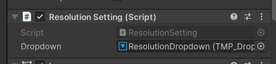
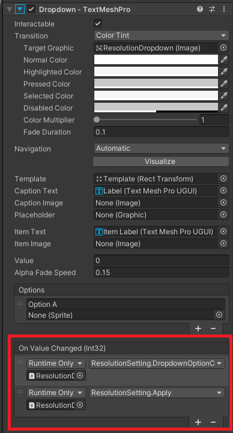
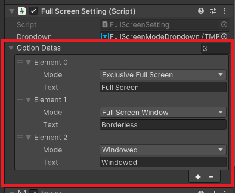
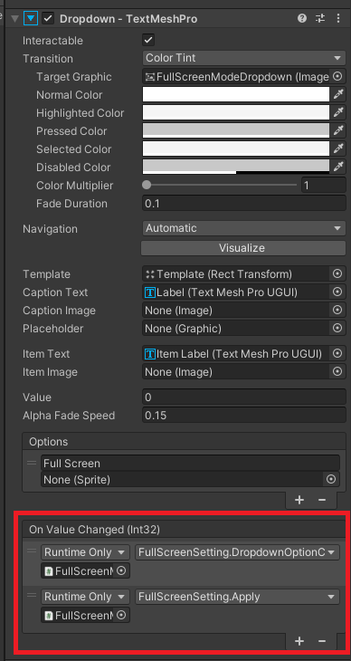
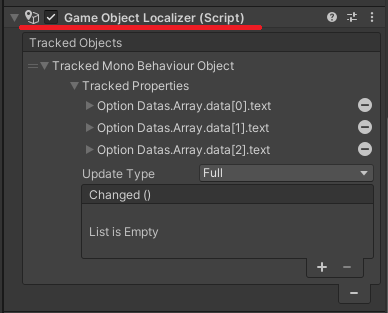

[<- 상위 페이지로 가기](../../../README.md)  

# ResolutionSetting & FullScreenSetting

## 목차
- [개요](#개요)
- [특징](#특징)
- [사용 방법](#사용-방법)
  - [해상도 설정 (ResolutionSetting)](#해상도-설정-resolutionsetting)
  - [전체 화면 설정 (FullScreenSetting)](#전체-화면-설정-fullscreensetting)

---

## 개요
`ResolutionSetting`과 `FullScreenSetting`은 Unity가 제공하는 `Screen` API를 기능적으로 가장할 수 있게 해준 UI 컨포넌트입니다. TMP_Dropdown을 활용해 사용자가 해상도 및 전체화면 목록을 선택할 수 있게 합니다.

## 특징
- Dropdown을 통해 쉽게 해상도와 전체화면 기능을 제공 
- 사용 가능한 해상도 목록을 모두 TMP_Dropdown에 자동 포함
- Apply() 함수로 원하는 시점에 적용 가능
- Prefab 제공

## 사용 방법

### 해상도 설정 (ResolutionSetting)
#### 컨포넌트

- `TMP_Dropdown`가 있는 오브젝트에 추가하기
- `Screen.resolutions`를 가지고 Dropdown을 자동 구성
- 현재 해상도와 일치하는 값을 자동으로 선택
- `Apply()` 호출으로 현재 화면 해상도로 바로 적용

#### Dropdown 설정 예시

- 빨간 테두리 부분이 중요 설정입니다:
  - On Value Changed: `DropdownOptionChange()`와 `Apply()`를 연결하여 사용자가 선택한 옵션이 즉시 적용되도록 합니다.
  - `DropdownOptionChange()`가 반드시 연결되어 있어야 변경사항을 추적할 수 있습니다.
  - 원한다면 `Apply()`를 제거하고 원하는 타이밍에 호출하여 적용시킬 수도 있습니다. 예를들면 환경설정 창을 닫을때 혹은 직접 적용하기 버튼을 눌렀을때. 
- `TMP_Dropdown`의 `Options`에 따로 추가할 필요가 없습니다.

#### API

#### `Apply()`
```csharp
public void Apply()
```
- 변경사항을 적용한다.


---
### 전체 화면 설정 (FullScreenSetting)
#### 컨포넌트

- `TMP_Dropdown`가 있는 오브젝트에 추가하기
- Dropdown에 추가할 mode와 표기될 text를 추가할 수 있습니다.
- 선택 후 `Apply()`를 호출하여 적용

#### Dropdown 설정 예시


- 빨간 테두리 부분이 중요 설정입니다:
  - On Value Changed: `DropdownOptionChange()`와 `Apply()`를 연결하여 사용자가 선택한 옵션이 즉시 적용되도록 합니다.
  - `DropdownOptionChange()`가 반드시 연결되어 있어야 변경사항을 추적할 수 있습니다.
  - 원한다면 `Apply()`를 제거하고 원하는 타이밍에 호출하여 적용시킬 수도 있습니다. 예를들면 환경설정 창을 닫을때 혹은 직접 적용하기 버튼을 눌렀을때. 
- `TMP_Dropdown`의 `Options`에 따로 추가할 필요가 없습니다.

#### API

#### `Apply()`
```csharp
public void Apply()
```
- 변경사항을 적용한다.

#### `InitUI()`
```csharp
public void InitUI()
```
- UI를 새로고침 한다.

#### 다국어 설정 예시

- GameObject Localizer를 사용하여 OptionData 내 `text` 항목들을 현지화하는 방식을 권장. `InitUI()`를 호출하여 Refresh할 수 있다.
